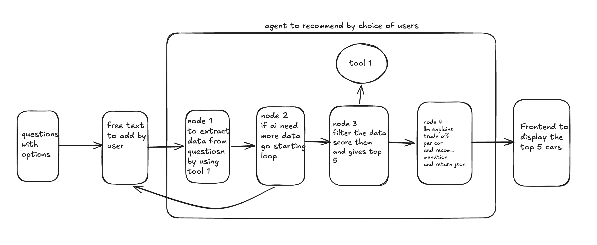

# CarDekho AI Advisor — Backend

## What did you build and why? What did you deliberately cut?

Built a FastAPI backend with a 4-node LangGraph agent that takes a buyer's car preferences (budget, use case, transmission, priority) and returns a ranked shortlist of 5 cars with personalized "why this fits" explanations and one honest trade-off per car. If the buyer's input is missing key info (budget or use case), the agent stops and asks a clarification question instead of guessing — this is the real decision point in the agent.

Built this because the brief asked for something that helps a confused buyer reach a confident shortlist. A guided agent that filters and explains its picks does that directly.

**Deliberately cut:**
- No database — a static 40-car `cars.json` loaded into RAM at startup is enough for this dataset size
- No vector search / embeddings — all filtering is on structured numeric/categorical fields (price, transmission, seating), which doesn't need semantic search
- No long-term memory across sessions — the buyer journey is single-session by design
- No follow-up conversational chat after the shortlist — out of scope for the time budget
- No authentication — not relevant to the brief

## What's your tech stack and why did you pick it?

- **FastAPI** — fast to set up, async-ready, pairs naturally with Pydantic for request/response validation
- **LangGraph** — gives native support for state, conditional edges, and the clarification loop, which is the actual "agentic" part of this system
- **Gemini 2.5 Flash (free tier)** — no cost, fast enough for structured extraction and short generations
- **Static `cars.json` (40 cars)** — loaded once into RAM via `car_loader.py`, no DB overhead for a dataset this size
- **In-memory session store** — keyed by `session_id`, sufficient for a single-session demo
- **black, isort, flake8** — fast to configure, keeps the codebase consistent without ceremony

## What did you delegate to AI tools vs. do manually? Where did the tools help most? Where did they get in the way?

**Delegated to AI:**
- Boilerplate FastAPI/Pydantic model scaffolding
- Initial draft of the LangGraph node structure
- Generating the 40-car synthetic dataset
- Iterating on the Gemini prompts for extraction and recommendation formatting
- Writing `search_cars_tool` — hard filters (budget, transmission, seating) plus weighted scoring (mileage/safety/space/features depending on buyer priority), with a budget-relaxation fallback if nothing matches
- Building `car_loader.py` to load the dataset once at startup with an absolute path, avoiding path resolution bugs depending on where `uvicorn` runs from

**Did manually:**
- Designing the agent architecture — 4 nodes, where the clarification loop sits, what triggers it
- Node 1 and Node 2 manually written to start the flow of the code
- Scoping decisions — deciding not to use a database, embeddings, or long-term memory
- I focus on state that is moving around the nodes and its transformation around it. Thats how I check the code. 
- I test the routes on my own and sometimes check the terminal for quick recap on what I did. 

**Where AI tools helped most:** 
- Scaffolding repetitive code (Pydantic schemas, node skeletons) and generating the synthetic dataset quickly — both would have taken much longer by hand. 
- Beyond scaffolding, AI tools were useful as a thinking partner for the agent design — I'd describe what a node or route should do, review the generated code to check it matched my intent, and only then add it to the codebase. 

**Where they got in the way:** 
- Generated code initially assumed a flatter folder structure than the one we designed, so imports and file paths needed manual correction across multiple files.
- Conversational memory for gemini is low, it tries to forgot the old conversations in chat, that are important for what I am building.
- The llms always agree on what you said, they dont try to correct you. For example prompting for Node 3, I made a mistake by asking for wrong state to return for Node 4. Even though previously I explain the whole agent architecture It never correct me, Later I corrected It myself.
- This is when I start new conversations.

## If you had another 4 hours, what would you add?

- Stream the Gemini recommendation response token-by-token instead of waiting for the full response
- Swap the in-memory session dict for PostgreSQL via LangGraph's PostgresSaver, so sessions survive restarts and the agent can resume from its last completed node instead of restarting the whole graph.
- Add follow-up conversational chat on top of the existing shortlist (e.g. "does any of these have a sunroof?")
- Cache repeated Gemini calls for identical buyer profiles to cut latency and API usage
- Add the conversational summary memory to store in db to know the user choices.
- add test files separately for each node, tool and endpoints.